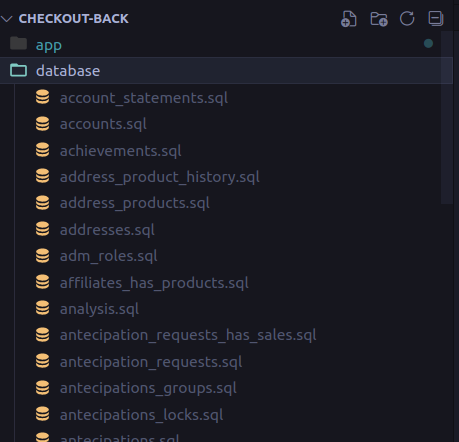

# Pré-requisitos

- [ ] Docker instalado localmente
- [ ] Docker Compose instalado localmente
- [ ] Necessário existir um dump do banco de dados na pasta database que fica no root do projeto.

### Download do Dump

Para fazer o download do dump basta estar logado com seu e-mail da empresa (@greenn.com.br) para acessar a pasta, dentro dessa pasta você vai encontrar um arquivo compactado com todas as tabelas (sql_files.tar.gz)

[Download do dump](https://drive.google.com/drive/folders/1MpsbG_wHIXiI2KYJ4RZGFUxH3oCZ64kd?usp=sharing)

### Extração dos arquivos

Extraia os arquivos compactados para a pasta database que esta no root do projeto, no final deve ficar dessa forma:

### Iniciando o projeto

Para iniciar o projeto pela primeira vez basta rodar o comando `make setup`, logo abaixo você pode encontrar todos os comandos disponiveis.

# Comandos disponiveis

| Comando        | Descrição                                                                       |
| -------------- | ------------------------------------------------------------------------------- |
| `make up`      | Inicia todos os containers e mantém terminal ativo com logs do NestJS.          |
| `make setup`   | Inicia todos os containers e restaura o dump para dentro da instancia do mysql. |
| `make down`    | Interrompe a execução dos containers.                                           |
| `make migrate` | Restaura o dump para dentro da instancia do MySQL.                              |
| `make reset`   | Reinicia os containers zerando o banco de dados e o redis.                      |
| `make logs`    | Observa os logs de todo o ambiente.                                             |
| `make help`    | Exibe as informações dos comandos disponiveis.                                  |

# Portas mapeados dos serviços

Para garantir que todos os projetos do Greenn possam rodar em apenas uma maquina as potas foram mapeadas de acordo com a tabela a seguir.

| Porta  | Serviço               |
| ------ | --------------------- |
| `3000` | Web (NodeJS + NestJS) |
| `3301` | MySQL                 |
| `6379` | Redis                 |
